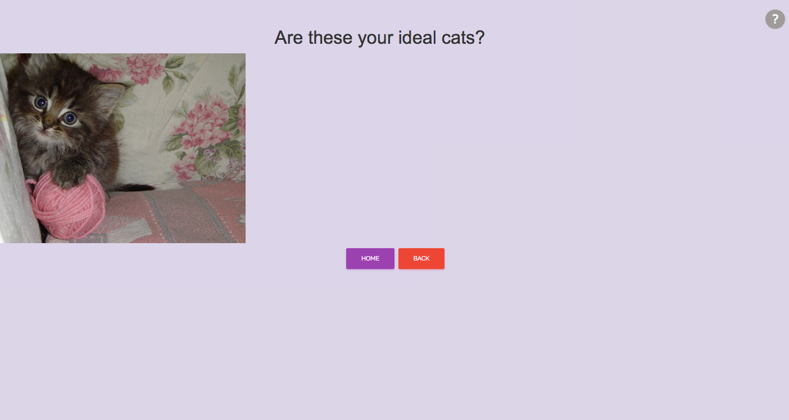

Milestone 4 Document

Team: .cat
Due: April 23, 2018

Hee Ro Chung
Kevin Jan
Sally Lai U
Kate Wong

UI Skeleton Webpages

Landing Page:

No change.

Cat Personalization Page:

The changes we've made on the customization page include changing the "done" button color from purple
to green, and adding a circular help button at the top right of the page. We made the "done" button
green because green is often associated with "success" or "agree" and the button "done" in our app
essentially plays that role. To give the user an easier way to detect which buttons have which
functionalities, we colored the buttons a certain way. Additionally, we added a help button in the
shape of a circle, in grey at the top right hand corner of the page. The help button gives general
directions on how to use the sliders on the customization page. We chose to make it circular so it
stands out, but grey so that it does not look obnoxious.

Help Modal:

In milestone3 we did not have a help button, so we decided to have a small help button on the customize page.
When a user clicks on the help button, a modal pops up with instructions on how to use the sliders.
We have made it grey for now because the entire app's overall scheme is not too bright or flashy.

Results Page:

No change.

Addressing User Privacy

Our web application does not gather user information other than what cat facial proportions the user prefers.
Even with the preferences that the user inputs, we only use that information to filter through the cat
database and provide the user with the results that most fit their criteria. These preferences are not saved
or used for anything else.
