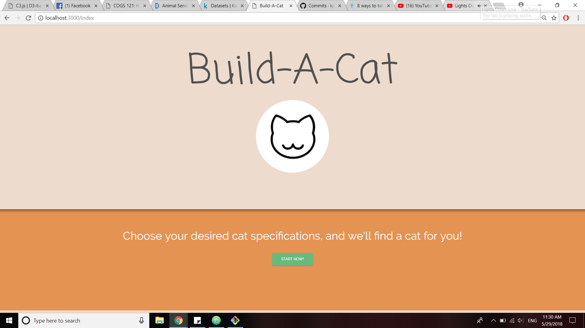
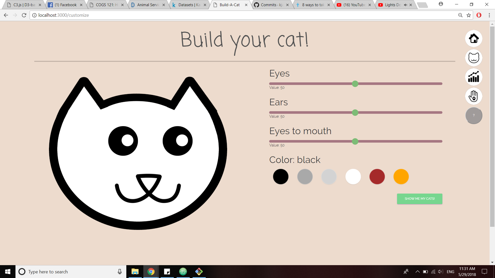
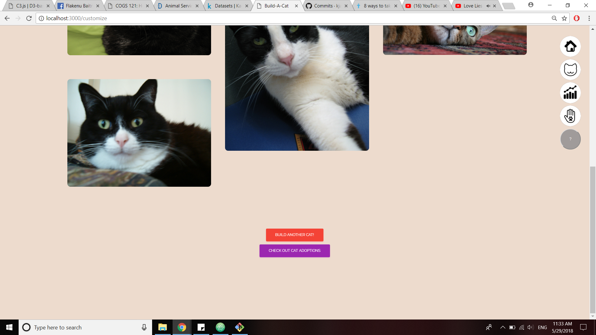
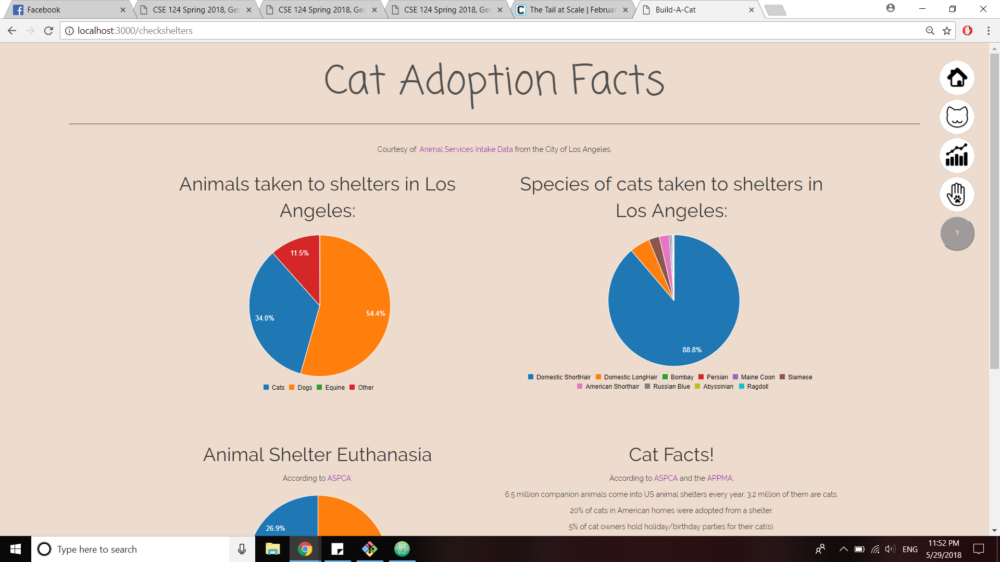
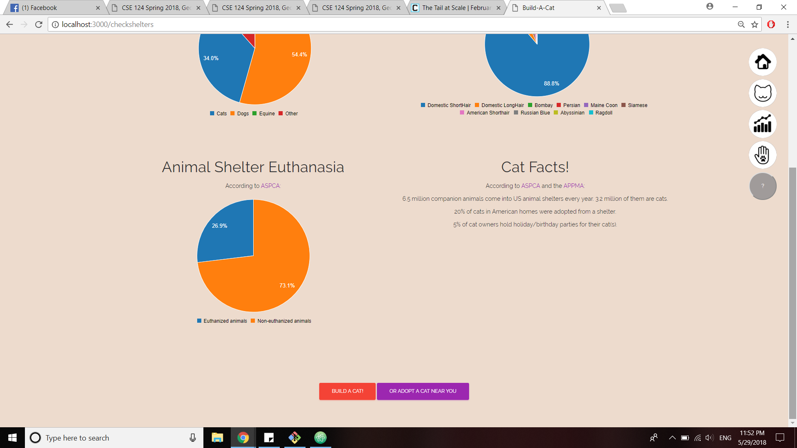

Milestone 6 Document

Team: .cat
Due: May 30, 2018

Hee Ro Chung
Kevin Jan
Sally Lai U
Kate Wong

UI Skeleton Webpages

Landing Page:

We changed the background colors to make the home page more colorful, aesthetic, and eye catching.

Cat Customization Page:

We changed the main text of the page from "Customize your cat" to "Build your cat" to be more consistent
with our app name. Additionally, we added circular buttons on the top right of the page with options that
allow users to navigate to different pages within the app including the "Home" button, the "Cat" or customization
page button, "Cat facts" button, a "petfinder" button, and the "help" button. The "petfinder" button links to
another website called Petfinder that helps people find the ideal pet they want to adopt.

Cat Results Page:

We added the same buttons from the cat customization page to allow users to continue to navigate through the
app even when they may be done using the app. We also added a "Check out cat adopting" button that leads to
the "Cat Facts" page to encourage users to view statistics regarding cat adoptions, and hopefully adopt more
cats!

Cat Statistics Page:

This is a new page that we added for this milestone incorporating data visualization. Some facts that we provide
include the percentage of different animals that are taken to animal shelters, which shows that cats are the
second highest animals that are taken to shelters. We offer similar statistics in the form of pie charts with
color differentiations to allow users to easily interpret the data. At the bottom of the page we have a button
so users can customize their cat, and a button so they can hopefully adopt a cat. These buttons are also available
on the right side of the page like the other pages have.

Data Visualization:

Our data visualization page contains three pie charts that display the following data: (1) what percentage of animals
that are taken to the animal shelter in Los Angeles are dogs, cats, and other (2) The distribution in species of
cats that are taken to the animal shelter in Los Angeles (3) The percentage of animals that are euthanized in these
animals shelter.
